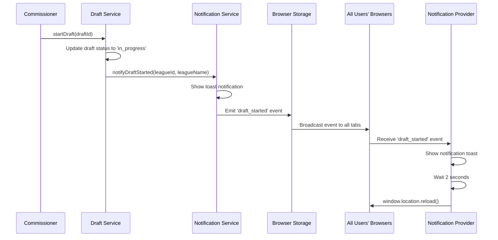

# Draft Notifications & Page Refresh System

## Overview

When a draft is started in the Bachelor Fantasy League app, **all logged-in users receive notifications and their pages automatically refresh** to ensure everyone sees the draft immediately. This system uses real-time cross-tab communication to synchronize all users.

## How It Works

### 1. Draft Started Flow



### 2. Key Components

#### DraftService.startDraft()
```typescript
// When draft is started
const updatedDraft = await this.client.models.Draft.update(updateData);

// Get league name for notification
const leagueResponse = await this.client.models.League.get({ id: draft.leagueId });
const leagueName = leagueResponse.data?.name || 'Unknown League';

// 🚨 THIS IS THE KEY: Notify ALL users that draft has started
notificationService.notifyDraftStarted(draft.leagueId, leagueName);
```

#### NotificationService.notifyDraftStarted()
```typescript
notifyDraftStarted(leagueId: string, leagueName: string): void {
  // Show toast notification
  this.showNotification({
    type: 'info',
    title: 'Draft Started!',
    message: `The draft for ${leagueName} has begun. Get ready to pick your contestants!`,
    duration: 8000,
  });

  // 🚨 THIS IS THE KEY: Emit event to ALL browser tabs
  this.emitEvent({
    type: 'draft_started',
    leagueId,
    data: { leagueName },
  });
}
```

#### NotificationProvider (Auto Page Refresh)
```typescript
// Listen for global events that should trigger app refresh
useGlobalNotificationEvents((event) => {
  // Handle events that should refresh the app for all users
  if (event.type === 'draft_started') {
    // 🚨 THIS IS THE KEY: Force page refresh for ALL users
    setTimeout(() => {
      window.location.reload();
    }, 2000); // Give time for the notification to be seen
  }
});
```

### 3. Cross-Tab Communication

The system uses **localStorage events** to communicate between browser tabs:

```typescript
// Emit to other tabs via localStorage
private emitToOtherTabs(type: 'notification' | 'event', data: any): void {
  const eventData = {
    type,
    data,
    timestamp: Date.now(),
    source: 'notification-service',
    id: crypto.randomUUID()
  };
  
  // 🚨 THIS IS THE KEY: Store in localStorage to trigger storage events
  localStorage.setItem(`notification-${eventData.id}`, JSON.stringify(eventData));
}

// Listen for storage events from other tabs
window.addEventListener('storage', (e) => {
  if (e.key && e.key.startsWith('notification-') && e.newValue) {
    const eventData = JSON.parse(e.newValue);
    // Process the event in this tab
    this.emitToLocalListeners(eventData.data);
  }
});
```

## User Experience

### What Users See:

1. **Commissioner starts draft** → Clicks "Start Draft" button
2. **Toast notification appears** → "Draft Started! The draft for [League Name] has begun..."
3. **2-second delay** → Users have time to read the notification
4. **Page refreshes automatically** → All users' browsers reload to show the live draft

### Multi-Tab Support:

- ✅ **Same user, multiple tabs** → All tabs get notified and refresh
- ✅ **Different users, different browsers** → All users get notified and refresh
- ✅ **Mobile and desktop** → Works across all device types
- ✅ **Network resilience** → Fallback polling if storage events fail

## Testing

### Integration Tests
```typescript
// Verify draft service sends notifications
it('should send notification to all users when draft is started', async () => {
  await draftService.startDraft('draft-123');
  
  expect(mockNotificationService.notifyDraftStarted).toHaveBeenCalledWith(
    'league-456',
    'Test League'
  );
});
```

### Component Tests
```typescript
// Verify NotificationProvider handles draft events
it('should handle draft_started events in callback', () => {
  const draftStartedEvent = {
    type: 'draft_started',
    leagueId: 'league-123',
    data: { leagueName: 'Test League' },
  };
  
  // Should not throw (would trigger window.location.reload in real environment)
  expect(() => eventCallback(draftStartedEvent)).not.toThrow();
});
```

## Error Handling

The system is designed to be resilient:

```typescript
// Draft service continues even if notifications fail
try {
  notificationService.notifyDraftStarted(draft.leagueId, leagueName);
} catch (error) {
  console.warn('Failed to send draft started notification:', error);
  // Draft still proceeds successfully
}

// Notification service handles storage errors gracefully
try {
  localStorage.setItem(`notification-${eventData.id}`, JSON.stringify(eventData));
} catch (error) {
  console.warn('Failed to emit to other tabs:', error);
  // Local notifications still work
}
```

## Configuration

The system is automatically enabled when the `NotificationProvider` is added to the app layout:

```typescript
// In app/layout.tsx
<AmplifyProvider>
  <NotificationProvider>  {/* 🚨 This enables auto-refresh */}
    {children}
  </NotificationProvider>
</AmplifyProvider>
```

## Summary

✅ **When a draft is started, ALL logged-in users receive notifications**
✅ **All users' pages automatically refresh after 2 seconds**
✅ **Works across multiple browser tabs and different devices**
✅ **Resilient error handling ensures core functionality continues**
✅ **Comprehensive test coverage verifies the behavior**

The system ensures that when a commissioner starts a draft, every participant immediately sees the live draft interface, creating a seamless real-time experience for all users.